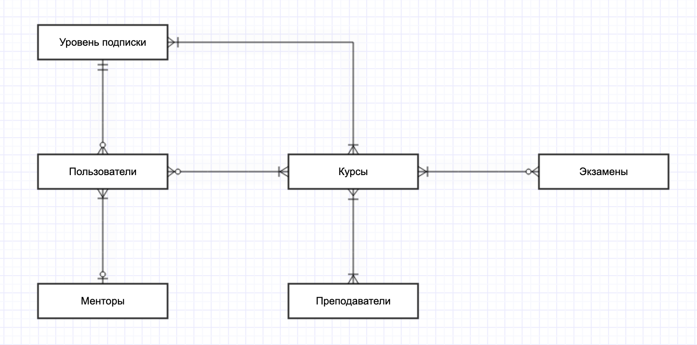

# Проект по курсу «Базы данных»
__Предметная область__: онлайн-школа. 

## Список сущностей
- Пользователи 
- Уровень подписки (единственен для каждого пользователя, определяет набор курсов, на которые может записываться пользователь)
- Курсы (каждый пользователь должен быть записан хотя бы на один курс)
- Преподаватели (один курс может вести один или несколько преподавателей)
- Экзамены (для успешного завершения курса может понадобиться сдать некоторое количество экзаменов, но есть курсы, на которых экзамены не предполагаются)
- Менторы (к обучающемуся может быть прикреплён не более, чем один ментор)

## Версионирование
Для версионирования выбрана сущность "Уровень подписки". В качестве механизма отслеживания изменений будет использоваться SCD2.

## Концептуальная модель базы данных
